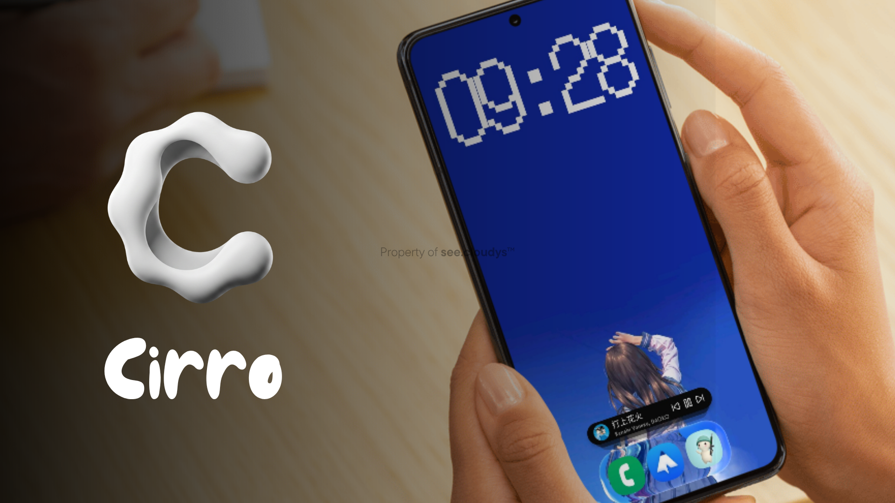

 

<!-- 
 -->

 

 

---

  
### 🔎 Features

<table>
  <tr>
    <td align="center" width="340" bgcolor="#0f1f2e">
       
      🌤️ 
      <b><code>01</code> Smart Pill Bar</b>  
    </td>
    <td align="center" width="340" bgcolor="#1a0f2e">
       
      🔥 
      <b><code>02</code> Habit Tracker</b>  
    </td>
  </tr>
  <tr>
    <td align="center" width="340" bgcolor="#1a2e0f">
       
      💰 
      <b><code>03</code> Money Manager</b>  
    </td>
    <td align="center" width="340" bgcolor="#2e1a0f">
       
      🗂️ 
      <b><code>04</code> Fast App Drawer</b>  
    </td>
  </tr>
  <tr>
    <td align="center" width="340" bgcolor="#2e1a2e">
       
      🎨 
      <b><code>05</code> Thematic Color Palettes</b>  
    </td>
    <td align="center" width="340" bgcolor="#1a2e2e">
       
      ⚡ 
      <b><code>06</code> Fluid & Efficient</b>  
    </td>
  </tr>
  <tr>
    <td align="center" width="340" bgcolor="#2e1a2e">
       
      🕒 
      <b><code>07</code> Custom Clock</b>  
    </td>
    <td align="center" width="340" bgcolor="#1a2e2e">
       
      🖼 
      <b><code>08</code> Depth Wallpaper</b>  
    </td>
  </tr>
  <tr>
    <td align="center" width="340" bgcolor="#2e1a2e">
       
      🕌 
      <b><code>09</code> Prayer Time</b>  
    </td>
    <td align="center" width="340" bgcolor="#1a2e2e">
       
       
      <b><code></code></b>  
    </td>
  </tr>
</table>

---

### 🤝 Contribute

<pre>
01  Fork the repository 🍴
02  git checkout -b feature/your-idea
03  git commit -m 'Add something beautiful ✨'
04  Push and open a Pull Request 🚀
</pre>

---

### 🔃 Upcoming features

| Feature                  | Status       | Release | Reject |
|------------------------|--------------|-----------|----------|
| Senior Mode | Backlog | | |
| Kids Mode | Backlog | | |
| Football League Info | Backlog | | |
| Separate Glass Dock Toogle | Backlog | | |
| Support theming of Bottomsheetbox | In-Progress | | |

---
### ⚠️ Google Play Protect Warning
Google Play Protect may flag this APK as an unrecognized app because it is not distributed through the Google Play Store. Rest assured, this app is **completely safe**. If you encounter any issues during your first installation, please follow these steps:

1. **Temporarily Disable Play Protect**  
   You may need to pause or temporarily turn off Google Play Protect to allow the initial installation to proceed smoothly.

2. **Bypass the Warning**  
   If the security warning appears, tap on **More details**, then select **Install anyway**.

3. **Scan for Viruses (Optional)**  
   If you are concerned about malware, you can safely re-enable Google Play Protect after the installation is successful and run a scan to verify the app's safety yourself.

### 🔒 Privacy & Security Guarantee

 This application **does not** collect, extract, share, or misuse any of your personal data. It is built purely for its intended functionality with the utmost respect for your device's security and your privacy.

---

<i>Simplicity is the ultimate sophistication</i> ✦ Leonardo da Vinci

 
 
 
 
 

&nbsp;&nbsp;

 

  <i>© 2026 see.cloudys Team — All rights reserved</i> 
  Private Launcher • Not for redistribution • Release

